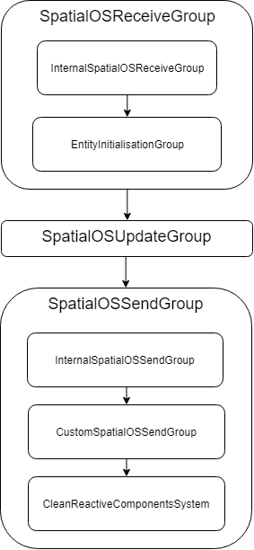

**Warning:** The [alpha](https://docs.improbable.io/reference/latest/shared/release-policy#maturity-stages) release is for evaluation purposes only, with limited documentation - see the guidance on [Recommended use](../../../README.md#recommended-use).

-----

## ECS: System update order

Unity provides attributes to define the [update order of systems](https://github.com/Unity-Technologies/EntityComponentSystemSamples/blob/master/Documentation/content/ecs_in_detail.md#system-update-order). These attributes are: `UpdateInGroup`, `UpdateBefore` and `UpdateAfter`.
> Note: You can only have one attribute of each type assigned to a system. If multiple are assigned they might override each other.

Here’s an example of how to assign an attribute to a system:

```csharp
[UpdateInGroup(typeof(SpatialOSUpdateGroup))]
public class ProcessColorChangeSystem : ComponentSystem
{
    …
}
```

The SpatialOS GDK for Unity (GDK) defines several update groups which run relative to `PlayerLoop.Update`. Most of your systems should belong to one of these (please don’t use groups which have “Internal” in the name - these are for internal use only). Using one of these groups will ensure that the system gets all state changes and that new changes get correctly propagated. The groups are executed in the following order:

* `SpatialOSReceiveGroup` - This group contains all of the systems related to receiving and handling data from SpatialOS.
  * `InternalSpatialOSReceiveGroup` - This is used by the `SpatialOSReceiveSystem`. **(Internal use only)**
  * `EntityInitialisationGroup` - Systems which initialize entities before game logic should run in this group.
* `SpatialOSUpdateGroup` - Most systems which use SpatialOS components should run in this group.
* `SpatialOSSendGroup` - This group contains all systems related to sending data to SpatialOS and cleaning up reactive components.
  * `InternalSpatialOSSendGroup` - This group is used by `SpatialOSSendSystem` which handles sending all replicated components to SpatialOS. **(Internal use only)**
  * `CustomSpatialOSSendGroup` - Systems which contain custom replication logic should run in this group.
  * `InternalSpatialOSCleanGroup` - This group is used by `CleanReactiveComponentsSystem` which removes all reactive components. **(Internal use only)**

Here's a diagram of the update order:  



### Update vs FixedUpdate

All of these groups run relative to `PlayerLoop.Update`, but sometimes you might want to run a system on `PlayerLoop.FixedUpdate`. An example of this is moving a GameObject at a fixed speed. You should do this in `PlayerLoop.FixedUpdate` because that will tick at regular intervals. This makes the movement look smooth and the GameObject move at the same speed, even if it takes `PlayerLoop.Update` longer to run. You can find more information on `Update` and `FixedUpdate` [here](https://unity3d.com/learn/tutorials/topics/scripting/update-and-fixedupdate).

The issue with running systems in `FixedUpdate` is that you might lose some reactive components when the system runs.

Reactive components have to be buffered. To do this there must be a system which runs on `PlayerLoop.Update` and adds all of the components which are required into a custom buffer component. The system which runs on `PlayerLoop.FixedUpdate` can then process all of the elements in the list.

-----

**Give us feedback:** We want your feedback on the SpatialOS GDK for Unity and its documentation  - see [How to give us feedback](../../../README.md#give-us-feedback).
